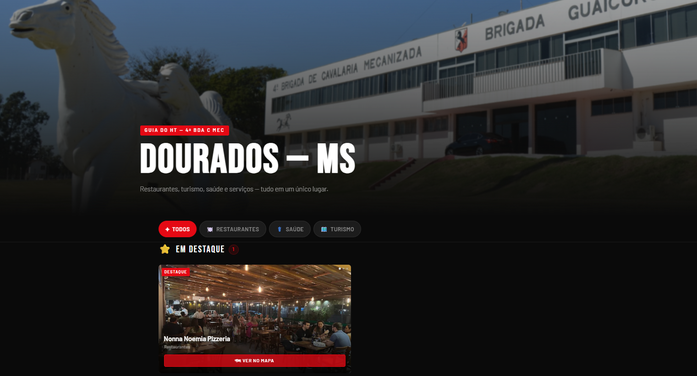

# Guia do HT — Dourados/MS

> Guia digital de serviços e opções locais para hóspedes do **Hotel de Trânsito de Dourados**, mantido pela 4ª Brigada de Cavalaria Mecanizada.



## Objetivo

Centralizar informações úteis para hóspedes em trânsito por Dourados/MS — como restaurantes, saúde, turismo e serviços — em uma interface simples, visual e compatível com dispositivos móveis.

O sistema foi pensado para que a atualização do conteúdo seja feita sem necessidade de alterar o código do site: basta preencher ou editar uma **Planilha Google**, que funciona como base de dados operacional do guia.

## Como funciona

```text
Equipe responsável
      ↓
Planilha Google
      ↓
Integração automática
      ↓
Site Guia do HT
      ↓
Hóspedes do Hotel de Trânsito
